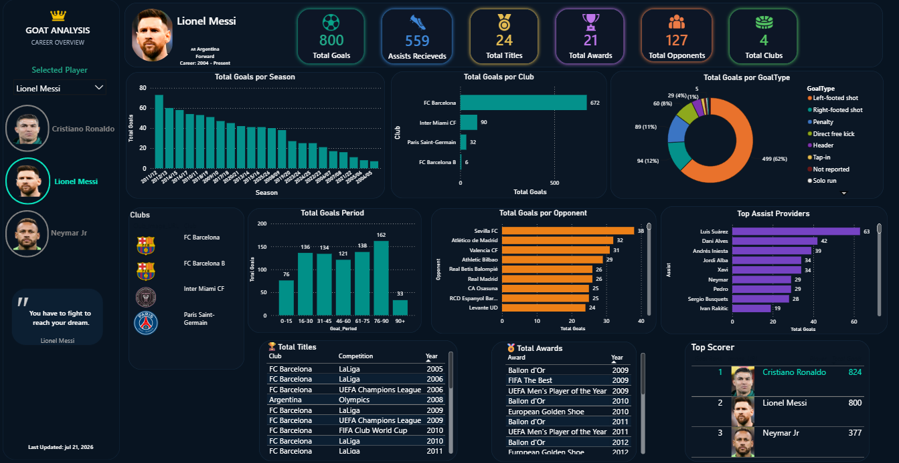
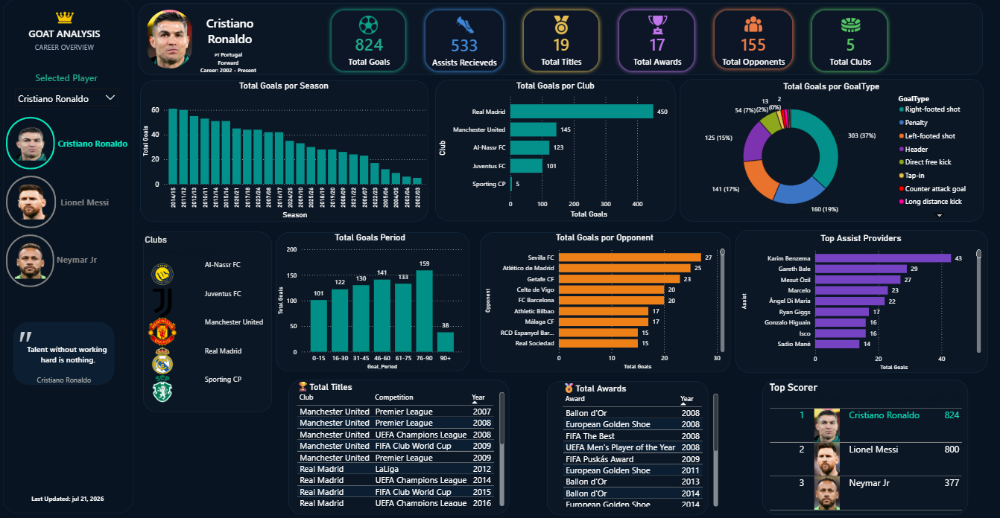
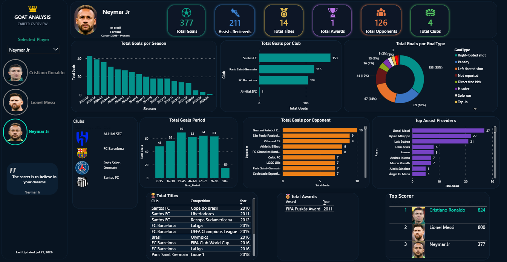
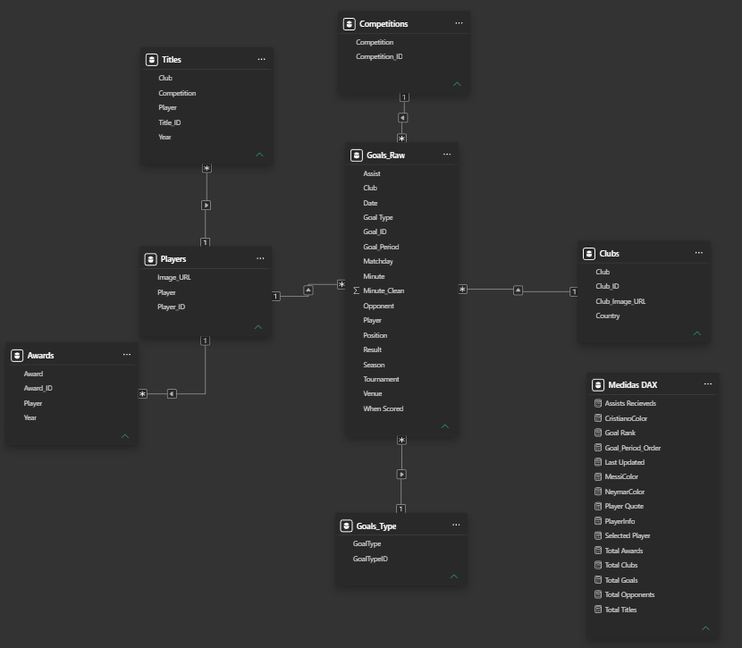

# GOAT Analysis ⚽📊

GOAT Analysis é um dashboard interativo desenvolvido em **Power BI** para análise comparativa da carreira de **Cristiano Ronaldo, Lionel Messi e Neymar Jr.**

O projeto foi construído a partir de uma base pública do Kaggle, enriquecida e remodelada por meio de processos de tratamento, modelagem de dados e desenvolvimento de métricas em DAX, resultando em uma solução analítica completa para exploração das estatísticas dos jogadores.

    

O projeto reúne estatísticas históricas de gols, assistências, títulos, prêmios individuais e clubes defendidos pelos três jogadores, entregando uma visualização moderna, interativa e profissional para explorar suas carreiras.

---

## 📂 Estrutura do Projeto

- `Goals_Raw.csv` → Base fato contendo todos os registros de gols, assistências, competições, adversários, clubes, temporadas e demais informações utilizadas nas análises.
- `Players.csv` → Informações dos jogadores e imagens utilizadas no dashboard.
- `Clubs.csv` → Clubes, países e escudos.
- `Competitions.csv` → Dimensão das competições.
- `GoalTypes.csv` → Tipos de gols.
- `Awards.csv` → Prêmios individuais conquistados.
- `Titles.csv` → Títulos conquistados durante a carreira.
- `GOAT Analysis.pbix` → Arquivo principal contendo modelagem, medidas DAX e dashboard completo.

---

## 🧠 Módulos do Dashboard

1. **Modelagem de Dados** → Modelo em estrela (Star Schema) utilizando tabelas fato e dimensões.
2. **Tratamento dos Dados** → Padronização das bases utilizando Google Sheets e Power Query.
3. **Medidas DAX** → KPIs automáticos, rankings e indicadores estatísticos.
4. **Visualizações Interativas** → Cards, gráficos de barras, gráfico de rosca, tabelas e imagens dinâmicas.
5. **Filtros Dinâmicos** → Seleção automática entre Cristiano Ronaldo, Lionel Messi e Neymar Jr.
6. **Design Profissional** → Dashboard inspirado em plataformas modernas de análise esportiva utilizando tema escuro.

---

## 🎨 Dashboard Principal

- KPIs de Gols, Assistências, Títulos, Prêmios, Adversários e Clubes
- Foto dinâmica do jogador selecionado
- Evolução de gols por temporada
- Distribuição dos gols por tipo
- Distribuição dos gols por período da partida
- Ranking dos clubes onde marcou gols
- Ranking dos adversários que mais sofreram gols
- Lista de clubes defendidos
- Histórico completo de títulos
- Histórico completo de prêmios individuais
- Top Assist Providers *(Caso implementado)*
- Career Rankings *(Caso implementado)*

---

## 🧰 Tecnologias Utilizadas

- Power BI Desktop
- DAX (Data Analysis Expressions)
- Power Query
- Google Sheets
- CSV (dados estruturados)
- GitHub para versionamento e portfólio

---

## 📚 Fonte dos Dados

A base de dados utilizada neste projeto foi obtida através do Kaggle e posteriormente tratada, padronizada e modelada para utilização no Power BI.

**Dataset utilizado:**

**Messi, Neymar, Ronaldo & Lewandowski - All Goals**
https://www.kaggle.com/datasets/hasibalmuzdadid/messi-neymar-ronaldo-lewandowski-all-goals

---

Durante o desenvolvimento foram realizadas diversas etapas de preparação dos dados, incluindo:

- Padronização de nomes de clubes e jogadores;
- Criação de tabelas dimensão;
- Modelagem em Star Schema;
- Criação de IDs relacionais;
- Tratamento de valores ausentes;
- Criação de colunas auxiliares para análise;
- Inclusão de imagens via URL para jogadores e clubes.

## 🎯 Objetivo do Projeto

Este projeto foi desenvolvido com foco em:

- Prática de análise de dados
- Desenvolvimento de dashboards profissionais
- Modelagem de dados em Power BI
- Construção de portfólio para área de Dados
- Aplicação de storytelling visual em dashboards esportivos

---

## 📌 Destaques do Projeto

✅ Dashboard totalmente interativo

✅ Comparação entre três dos maiores jogadores da história

✅ Layout moderno inspirado em dashboards esportivos

✅ KPIs desenvolvidos em DAX

✅ Fotos e escudos carregados via URL

✅ Modelagem em Star Schema

✅ Tratamento completo dos dados utilizando Power Query

✅ Storytelling aplicado ao esporte

---

## 📷 Preview

### 🏠 Dashboard

    
    

### 📊 Modelo de Dados

    

---

## ▶ Como Utilizar

1. Faça o download do arquivo `.pbix`
2. Abra utilizando o Power BI Desktop
3. Atualize as fontes CSV caso necessário
4. Utilize o filtro de jogadores para navegar entre Cristiano Ronaldo, Lionel Messi e Neymar Jr.

---

## 🚀 Melhorias Futuras

- Ranking personalizado dos jogadores
- Comparação simultânea entre jogadores
- Dashboard Mobile
- Publicação no Power BI Service
- Estatísticas por competição
- Novos indicadores avançados

---

## 👨‍💻 Autor

**Diego Rocha**

Data Analytics Student | SQL | Power BI | Business Intelligence

- GitHub: https://github.com/DiegoHenriqueNR
- LinkedIn: https://www.linkedin.com/in/diego-rocha-b018331b6

---

## ⭐ Gostou do projeto?

Se este projeto foi útil ou interessante, considere deixar uma **⭐ no repositório**. Isso ajuda na divulgação do trabalho e incentiva o desenvolvimento de novos projetos.
